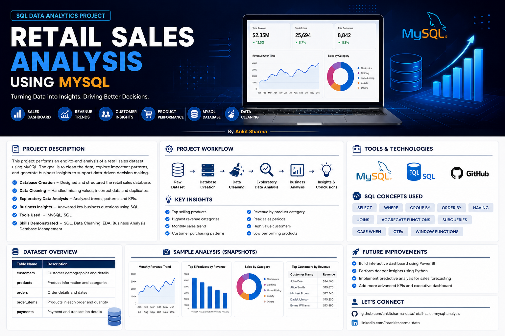
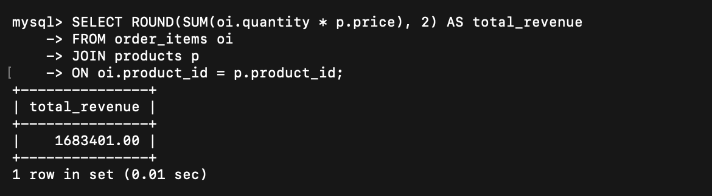
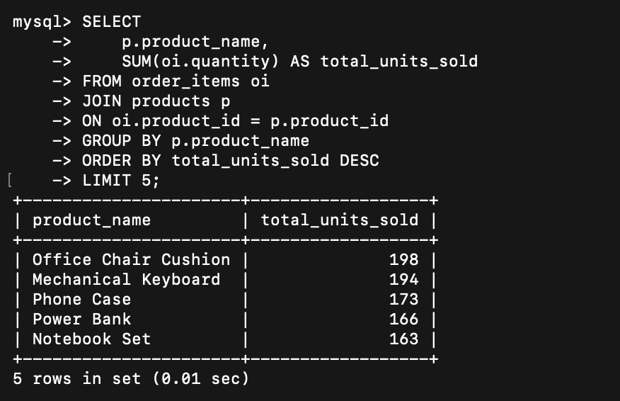
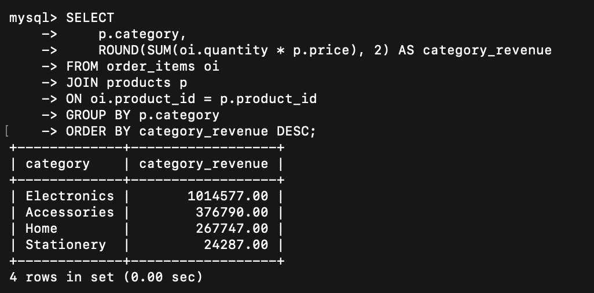
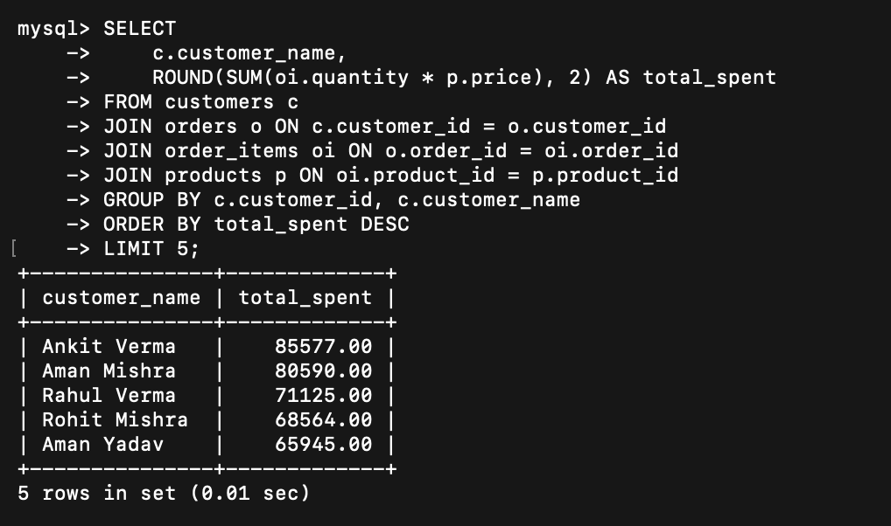
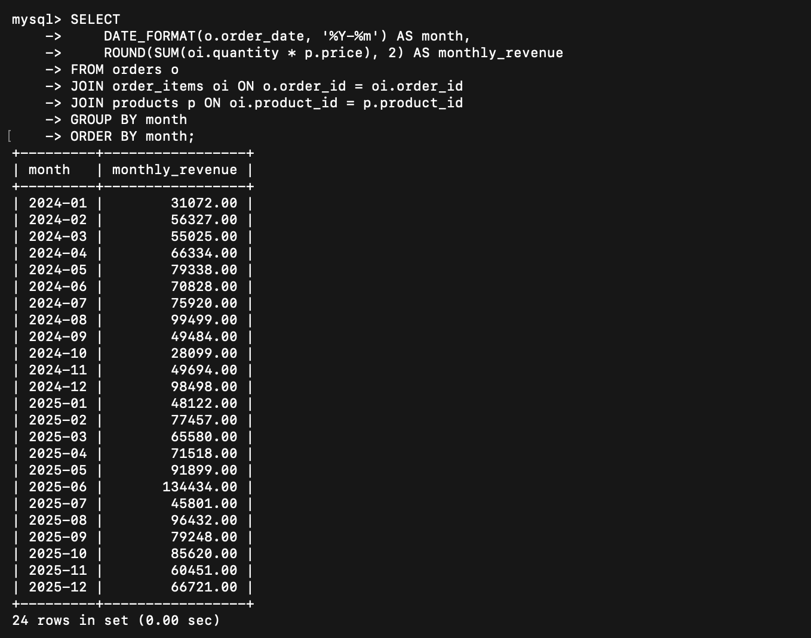

# 🛍️ Retail Sales Analysis using MySQL

## 📊 Key Results

- 💰 Total Revenue: ₹16,83,401
- 🛍️ Highest Revenue Category: Electronics
- 👤 Top Spending Customer: Ankit Verma
- 📈 Monthly Revenue Trend Analysis
- 🏆 Best Selling Products
- 🌍 City-wise Sales Analysis

## 📌 Project Overview

This project involves a relational database for retail sales data (customers, products, orders, and order items) built in MySQL and analyzed using SQL to answer business questions related to revenue trends, top-performing products, and customer behavior.

---

## 🛠️ Tech Stack

- MySQL
- SQL
- Git
- GitHub

---

## 📂 Repository Structure

```text
retail-sales-mysql-analysis
│
├── images/
│   └── cover.png
├── 01_schema.sql
├── 02_seed_data.sql
├── 03_analysis_queries.sql
└── README.md
```

---
# Retail Sales Analysis using MySQL

## Overview
A relational database of retail sales (customers, products, orders, and order items) built in MySQL, analyzed using SQL to answer business questions like revenue trends, top products, and customer behavior.

## Database Schema
- **customers** — customer_id, customer_name, city, signup_date
- **products** — product_id, product_name, category, price
- **orders** — order_id, customer_id, order_date
- **order_items** — order_item_id, order_id, product_id, quantity

40 customers, 12 products, 250 orders, 625 order line items.

## Business Questions Answered
1. How much total revenue generated?
2. Which product sells more units??
3. Which product category generates more revenue??
4. What is the month-over-month revenue trend?
5. Who are our highest-spending customers??
6. Which city generates more orders??
7. What is the average order value?
8. Are there any customers who have not made a purchase yet??
9. Which customers buy from us repeatedly??
10. Which products underperform compared to the average??

## Tools Used
- MySQL
- SQL (joins, GROUP BY, HAVING, subqueries, DATE_FORMAT)

## Files
- `01_schema.sql` — creates the database and tables
- `02_seed_data.sql` — inserts sample data (40 customers, 12 products, 250 orders, 625 order items)
- `03_analysis_queries.sql` — 10 analysis queries

## How to Run (XAMPP / MySQL Workbench)

### Option A: Using phpMyAdmin (XAMPP)
1. Install XAMPP and start Apache + MySQL from the control panel.
2. Open `http://localhost/phpmyadmin` in your browser.
3. Click **Import** → choose `01_schema.sql` → click **Go**.
4. Click **Import** again → choose `02_seed_data.sql` → click **Go**.
5. Click on the `retail_sales` database → **SQL** tab → paste queries from `03_analysis_queries.sql` one at a time and run.

### Option B: Using MySQL Workbench
1. Open MySQL Workbench and connect to your local MySQL server.
2. Open `01_schema.sql` → click the lightning bolt icon (Execute) to run the whole script.
3. Open `02_seed_data.sql` → Execute.
4. Open `03_analysis_queries.sql` → run each query (select it, then Ctrl+Enter) to see results.

### Option C: Command line
```bash
mysql -u root -p < 01_schema.sql
mysql -u root -p < 02_seed_data.sql
mysql -u root -p retail_sales < 03_analysis_queries.sql
```

## Key Findings
• Total revenue across all orders: ₹16,83,401
• Electronics is the highest-revenue category, accounting for approximately 60% of total revenue.
• Average order value (AOV): ₹6,733.60
• Top customer by spend: Ankit Verma (Customer ID: 32), with a total spend of ₹85,577.
• Most frequent repeat buyer: Aman Mishra (Customer ID: 27), with 12 separate orders.
• Stationery items (e.g., Notebook Set) consistently underperform compared to other categories.

## Note

•Customer names in the sample data are not unique; multiple customers may share the same name, as often occurs in real-world systemes. Therefore, queries that report per-customer results group by 'customer_id' rather than customer name to ensure accurate customer-level metrics.

•This project was initially prototyped in SQLite for query development and was later converted to standard MySQL syntax (including AUTO_INCREMENT, the InnoDB storage engine, and DATE_FORMAT). All scripts were verified by executing them against a MySQL 8 instance.


---

## 📷 SQL Query Outputs

### 💰 Total Revenue



---

### 🏆 Top Selling Products



---

### 📊 Sales by Category



---

### 👤 Top Customers



---

### 📅 Monthly Revenue Trend


